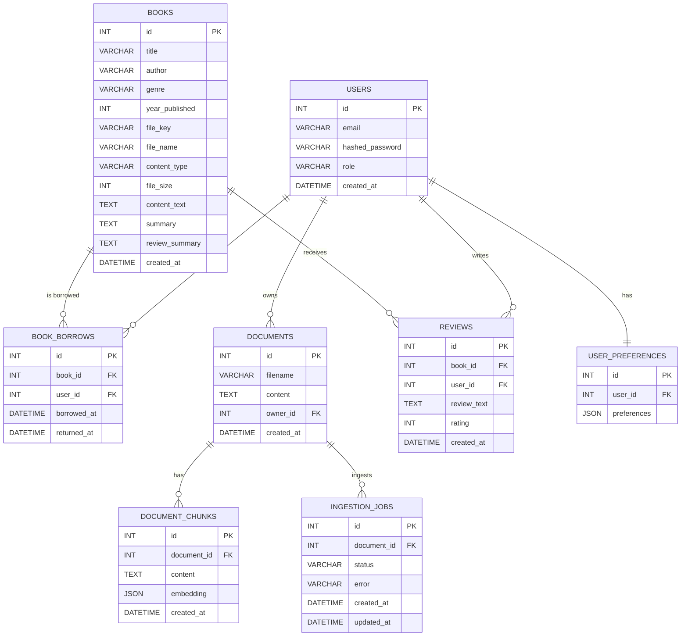

# Database Schema

This document reflects the current database schema defined in the backend SQLAlchemy models.

## ER Diagram

## Primary Key to Foreign Key Links

- `book_borrows.book_id` → `books.id`
- `book_borrows.user_id` → `users.id`
- `documents.owner_id` → `users.id`
- `document_chunks.document_id` → `documents.id`
- `ingestion_jobs.document_id` → `documents.id`
- `reviews.book_id` → `books.id`
- `reviews.user_id` → `users.id`
- `user_preferences.user_id` → `users.id` (unique 1:1)
